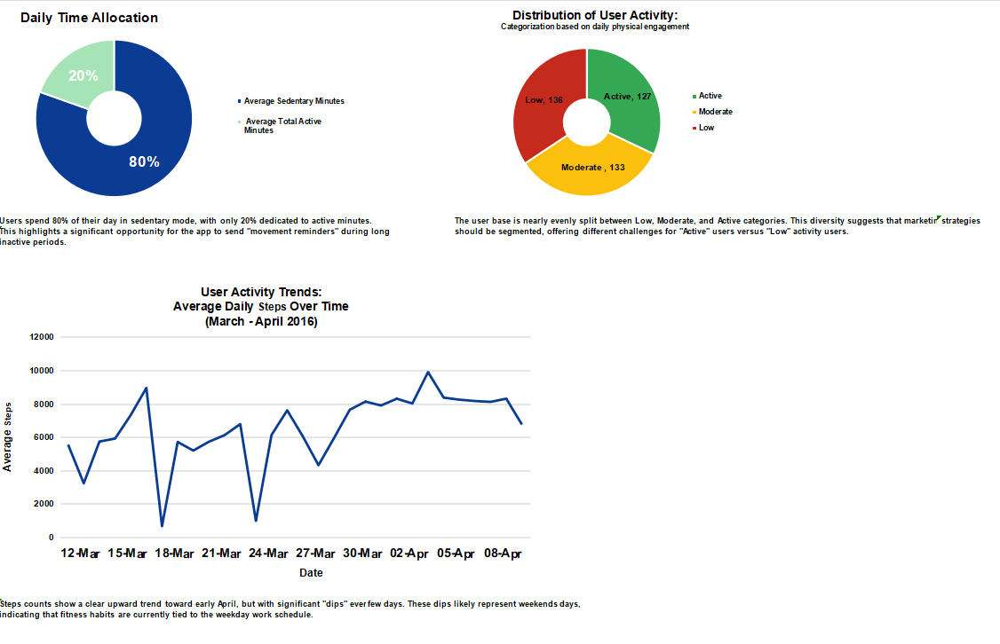
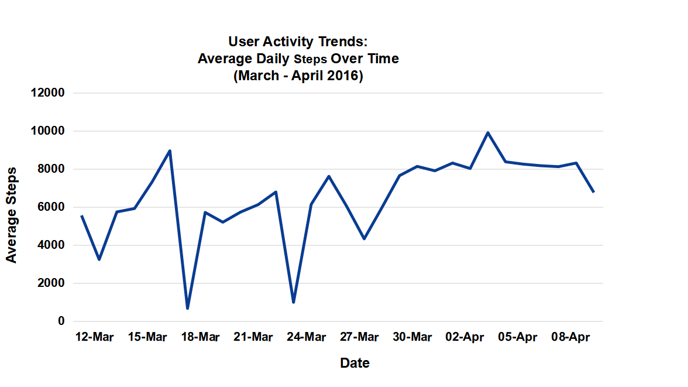
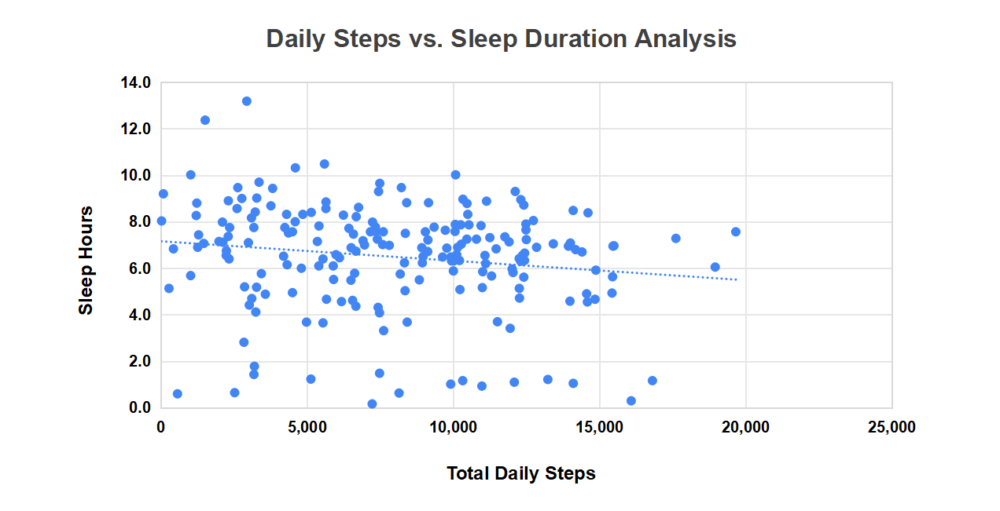

# Bellabeat Smart Device Usage Analysis
### Google Data Analytics Capstone (Case Study)

---

## Table of Contents
1. [Introduction](#introduction)
2. [Ask](#ask)
3. [Prepare](#prepare)
4. [Process](#process)
5. [Analyze](#analyze)
6. [Share](#share)
7. [Act](#act)

---

## Introduction

This case study was completed as the capstone project for the **Google Data Analytics Professional Certificate**. I take on the role of a junior data analyst on the marketing analytics team at **Bellabeat**  a high-tech manufacturer of health-focused products for women.

The goal is to analyze how consumers use non Bellabeat smart devices, identify behavioral trends, and translate those findings into actionable marketing recommendations for one of Bellabeat's products.

**The six-phase data analysis process used:**
`Ask` → `Prepare` → `Process` → `Analyze` → `Share` → `Act`

---

## Ask

### Business Task
Analyze FitBit smart device usage data to identify trends in how consumers engage with fitness trackers, then apply those insights to Bellabeat's marketing strategy.

### Guiding Questions
1. What are some trends in smart device usage?
2. How could these trends apply to Bellabeat customers?
3. How could these trends help influence Bellabeat's marketing strategy?

### Key Stakeholders
- **Urška Sršen** — Cofounder & Chief Creative Officer, requested this analysis
- **Sando Mur** — Cofounder, key member of the executive team
- **Bellabeat Marketing Analytics Team**  primary audience for findings

### Product Focus
This analysis focuses on the **Bellabeat Leaf** — the classic wellness tracker worn as a bracelet, necklace, or clip — which tracks activity, sleep, and stress via the Bellabeat app. The Leaf is the product most directly informed by the behavioral patterns found in this dataset.

---

## Prepare

### Data Source
**FitBit Fitness Tracker Data**
- **Source:** [Kaggle — Möbius](https://www.kaggle.com/datasets/arashnic/fitbit)
- **License:** CC0 Public Domain
- **Collection period:** March 12 – April 12, 2016
- **Participants:** 33 FitBit users who consented to share personal tracker data

### Data Contents
The dataset includes minute level and daily level records for:
- Physical activity (steps, distance, active minutes, calories)
- Sleep (time asleep, time in bed, sleep stages)
- Sedentary behavior

### ROCCC Assessment (Credibility Check)

| Criteria | Assessment |
|---|---|
| **Reliable** | ⚠️ Low — only 33 users; small sample size |
| **Original** | ⚠️ Third party data collected via Amazon Mechanical Turk |
| **Comprehensive** | ⚠️ No demographic data (age, gender, health conditions) |
| **Current** | ❌ 2016 data  nearly a decade old |
| **Cited** | ✅ Publicly available, properly attributed |

### Known Limitations
- Sample size of 33 is too small to draw population level conclusions
- No demographic information  Bellabeat targets women, but participant gender is unconfirmed
- Days with 0 steps likely represent device non use, not actual inactivity  inflating sedentary metrics
- Sleep data is incomplete — many users did not consistently wear the device at night
- 2016 data may not reflect current smart device usage behaviors

---

## Process

### Tool Used
**Microsoft Excel**  chosen for its accessibility, built in pivot table and charting capabilities, and suitability for this dataset size (33 users, ~1 month of data).

### Cleaning Steps Performed

**1. Date Formatting**
- Raw activity dates were stored as Excel serial numbers (e.g., `42454`)
- Converted all date columns to readable `DD-MMM` format using Excel date functions

**2. Duplicate and Null Checks**
- Checked all rows for duplicate User ID + Date combinations
- Flagged rows where TotalSteps = 0 and SedentaryMinutes = 1440 as likely non-wear days

**3. Data Type Validation**
- Confirmed numeric fields (steps, calories, minutes) were stored as numbers, not text
- Verified no negative values existed in any activity or sleep columns

**4. Sleep Data Join**
- Sleep logs existed in a separate table
- Matched to activity records using a composite key (`Date + User ID`)
- Records with no sleep match were labeled `#N/A` and excluded from sleep-specific analysis

**5. Calculated Columns Added**
- `Total Active Minutes` = VeryActiveMinutes + FairlyActiveMinutes + LightlyActiveMinutes
- `Sleep Hours` = MinutesAsleep ÷ 60
- `Activity Category` = User sessions classified as Low / Moderate / Active based on daily step count

**6. Pivot Tables Created**
- `Pivot_Daily_Averages` — average steps per day across all users over the 31-day period
- `Pivot_Sleep_Summary` — sleep hours per user per date for correlation analysis

---

## Analyze

### Summary Statistics

| Metric | Value |
|---|---|
| Average Daily Steps | **7,555** |
| Average Daily Calories Burned | **2,284** |
| Average Sedentary Minutes/Day | **942 min (~15.7 hrs)** |
| Average Active Minutes/Day | **229 min (~3.8 hrs)** |
| Minimum Steps Recorded | 4 |
| Maximum Steps Recorded | 28,497 |

---

### Finding 1 — Users Are Sedentary for 80% of Their Day

The most striking finding in the data: users spend an average of **942 minutes per day — roughly 15.7 hours — in a sedentary state.** That is 80% of their tracked day with no meaningful physical movement.

Only 20% of the day is spent in any form of active minutes. This is not driven by a few extreme outliers — the pattern is consistent across the dataset. Users are wearing a fitness tracker while remaining largely inactive, which represents both a health gap and a product opportunity.

---

### Finding 2 — Average Daily Steps Fall Short of the 10,000-Step Benchmark

The dataset average of **7,555 steps/day falls approximately 25% below** the 10,000-step daily goal that most fitness devices and health guidelines reference. While 10,000 steps is not a strict medical standard, it is the benchmark the target user base recognizes and compares themselves to.

The step distribution is also highly variable  some users consistently exceeded 10,000 steps while others logged near-zero days regularly, pointing to significant engagement differences across the user base.

---

### Finding 3 — The User Base Is Nearly Evenly Split Across Three Activity Tiers

When user sessions are categorized by daily physical engagement level:

| Activity Level | Session Count |
|---|---|
| Active | 127 |
| Moderate | 133 |
| Low | 136 |

The near-equal three-way split is a critical segmentation insight. Bellabeat cannot treat its users as a single group  a one size fits all message or product experience will miss at least two thirds of its audience. Each tier has different needs, motivations, and entry points.

---

### Finding 4 — Steps Trended Upward Over 31 Days, With Consistent Weekend Drops

Tracking average daily steps from March 12 to April 12:

- **Early March (weeks 1–2):** Average steps ranged from 3,000 to 6,000
- **Late March through April (weeks 3–5):** Average steps stabilized between 7,500 and 9,900
- **Sharp drops visible around March 18 and March 24** both correspond to weekends

Two conclusions come from this pattern:
1. **Habit formation is visible in the data**  consistent device use correlates with increasing activity over time
2. **Physical activity is heavily tied to weekday routines**   weekends show a reliable and significant step count decline across the user base

---

### Finding 5 — Steps and Sleep Show a Weak Negative Relationship; Sleep Tracking Is Underused

The scatter plot of Total Daily Steps vs. Sleep Hours reveals a slight downward trend: users who walk more tend to sleep marginally fewer hours. The relationship is **weak**  data is widely scattered and no strong predictive pattern exists.

The more actionable finding is the volume of missing sleep data. A large share of activity records have no corresponding sleep entry, meaning many users either remove the device at night or do not use the sleep tracking feature at all. Sleep is one of Bellabeat's core product pillars  and it is the least engaged with feature in this dataset.

---

## Share

### Visualizations

**Dashboard Overview**



---

**User Activity Trends: Average Daily Steps Over Time (March–April 2016)**



The upward trend in steps, with weekend dips, tells a clear behavioral story: users are more active during work weeks and disengage on weekends. The improvement over 31 days supports the case that consistent device wear builds activity habits over time.

---

**Daily Steps vs. Sleep Duration Analysis**



The scatter plot shows a weak negative correlation between steps and sleep hours. The most important takeaway is not the correlation itself, but how much sleep data is simply absent  indicating this feature is significantly underutilized.

---

## Act

### Top Recommendations for Bellabeat Marketing Strategy

---

**Recommendation 1: Make Movement Reminders a Hero Feature of the Leaf**

With 80% of the day spent sedentary, the single highest-impact feature Bellabeat can market is a **haptic movement reminder**  a gentle vibration after 60–90 minutes of inactivity. The Leaf is already on the body. It is positioned to prompt movement without requiring users to check their phone.

Marketing angle: *"The Leaf doesn't just track your day   it reminds you to live it."*
This directly addresses the most significant behavioral gap in the data, with zero friction for the user.

---

**Recommendation 2: Build Three Distinct Campaign Tracks Based on Activity Tier**

The near-equal split across Low, Moderate, and Active users means Bellabeat needs **segmented messaging**, not a single campaign:

- **Low activity users:** Remove performance pressure. Lead with accessibility and small wins  *"Start somewhere. The Leaf starts with you."*
- **Moderate users:** Emphasize consistency and progress  *"You're building a habit. Keep going."*
- **Active users:** Lead with data depth and achievement tracking — *"You know what you're doing. Now track every detail of it."*

One message for all three groups will connect with only one of them.

---

**Recommendation 3: Close the Weekend Gap With Targeted Content**

The consistent step count drop on weekends is a predictable, recurring behavior that Bellabeat can directly address. The Leaf app should send **Friday wellness prompts**   outdoor walks, morning stretches, weekend movement ideas  to shift how users think about their non-work days.

Marketing positioning: the weekend is not a rest from wellness. It is the best time for it. Position the Leaf as the companion for that mindset.

---

**Recommendation 4: Actively Promote Sleep Tracking — It Is Being Ignored**

The high rate of missing sleep data is a product engagement problem. Sleep tracking is a core Bellabeat differentiator, and it is the most underused feature in this dataset. Bellabeat should:
- Add clear in-app onboarding that explains the value of sleep data
- Show users a personal sleep activity connection in their weekly summary
- Run campaigns framing sleep as the foundation of performance, not an optional add-on

Users who engage with sleep tracking tend to develop deeper platform engagement overall — they are worth acquiring and retaining specifically.

---

**Recommendation 5: Use Habit Formation as a Marketing Story**

The 31-day upward trend in average steps is a ready-made acquisition narrative: **wearing the Leaf makes you more active.** Bellabeat can use this as proof in campaigns — showing prospective users what a 30-day journey looks like  and as a retention tool by surfacing personal progress milestones inside the app.

*"See what 30 days with the Leaf did for users like you."* This is not a claim  it is what the data shows.

---

### Additional Data That Would Strengthen This Analysis

- **Bellabeat's own user data** — to validate whether FitBit trends hold for Bellabeat's actual female customer base
- **Demographic data** (age, location, health goals) to refine segmentation beyond activity tier alone
- **More recent dataset** — 2016 predates major shifts in wearable adoption and post-pandemic health awareness
- **Heart rate and stress data** — available in the FitBit dataset but not analyzed here; directly relevant to Bellabeat's stress-tracking value proposition

---

## File Structure

```
├── Bellabeat_Case_Study_Analysis.xlsx         # Full workbook: raw data, cleaning, pivots, analysis
├── dashboard.png                              # Final Excel dashboard
├── User_Activity_Trends.png                   # Average daily steps over time (March–April 2016)
├── Daily_Steps_vs_Sleep_Duration_Analysis.png # Scatter plot: daily steps vs. sleep hours
└── README.md                                  # This document
```

---

## About

**Analyst:** [Ayesha Nisar]  
**Certificate:** Google Data Analytics Professional Certificate  
**Case Study:** Case Study 2 — How Can a Wellness Technology Company Play It Smart?  
**Tool:** Microsoft Excel  
**Dataset:** [FitBit Fitness Tracker Data](https://www.kaggle.com/datasets/arashnic/fitbit) — CC0 Public Domain via Kaggle
